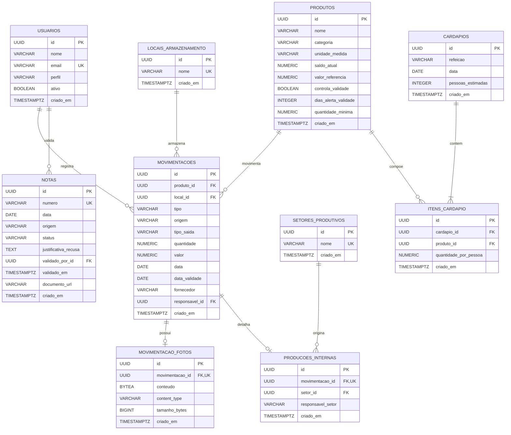

# Modelagem de Dados

## 1. Introdução

Este documento descreve a modelagem de dados do **Gestão Refeitório**, considerando o estado atual das migrations Flyway e das entidades JPA do backend.

O sistema utiliza:

- PostgreSQL como sistema gerenciador de banco de dados;
- UUID como identificador primário das entidades;
- Flyway para criação e evolução versionada do esquema;
- Spring Data JPA/Hibernate para o mapeamento objeto-relacional;
- `TIMESTAMPTZ` para datas e horas de auditoria;
- `NUMERIC` para quantidades e valores monetários, evitando perda de precisão.

As migrations são a fonte oficial da estrutura física do banco e estão em `backend/src/main/resources/db/migration`.

## 2. Visão geral do modelo

O modelo está dividido nos seguintes domínios:

| Domínio | Tabelas | Responsabilidade |
|---|---|---|
| Acesso | `usuarios` | Identidade, perfil e situação dos usuários. |
| Estoque | `produtos`, `locais_armazenamento`, `movimentacoes`, `movimentacao_fotos` | Catálogo, saldos, entradas, saídas, armazenamento e evidências. |
| Produção interna | `setores_produtivos`, `producoes_internas` | Origem interna de produtos recebidos pelo refeitório. |
| Cardápio | `cardapios`, `itens_cardapio` | Planejamento das refeições e projeção de consumo. |
| Notas | `notas` | Registro e validação de documentos de recebimento. |

## 3. Diagrama entidade-relacionamento



Legenda:

- `PK`: chave primária;
- `FK`: chave estrangeira;
- `UK`: restrição de unicidade;
- `||`: exatamente um;
- `o|`: zero ou um;
- `o{`: zero ou muitos;
- `|{`: um ou muitos no modelo de negócio.

## 4. Dicionário de dados

### 4.1. `usuarios`

Armazena as identidades autorizadas a utilizar o sistema.

| Coluna | Tipo | Restrições | Descrição |
|---|---|---|---|
| `id` | `UUID` | PK, `DEFAULT gen_random_uuid()` | Identificador do usuário. |
| `nome` | `VARCHAR(255)` | `NOT NULL` | Nome completo. |
| `email` | `VARCHAR(255)` | `NOT NULL`, `UNIQUE` | E-mail utilizado como identidade de acesso. |
| `perfil` | `VARCHAR(30)` | `NOT NULL` | Perfil de autorização. |
| `ativo` | `BOOLEAN` | `NOT NULL`, padrão `TRUE` | Indica se o acesso está habilitado. |
| `criado_em` | `TIMESTAMPTZ` | `NOT NULL`, padrão `now()` | Data e hora de criação. |

Valores válidos na aplicação para `perfil`: `ADMIN`, `NUTRICIONISTA` e `COZINHA`.

### 4.2. `produtos`

Mantém o catálogo de insumos e os parâmetros de controle de estoque.

| Coluna | Tipo | Restrições | Descrição |
|---|---|---|---|
| `id` | `UUID` | PK, `DEFAULT gen_random_uuid()` | Identificador do produto. |
| `nome` | `VARCHAR(255)` | `NOT NULL` | Nome do insumo. |
| `categoria` | `VARCHAR(100)` | `NOT NULL` | Categoria usada na organização e nos filtros. |
| `unidade_medida` | `VARCHAR(20)` | `NOT NULL` | Unidade como kg, L ou un. |
| `saldo_atual` | `NUMERIC(12,3)` | `NOT NULL`, padrão `0` | Saldo consolidado do produto. |
| `valor_referencia` | `NUMERIC(12,2)` | Opcional | Valor utilizado como referência. |
| `controla_validade` | `BOOLEAN` | `NOT NULL`, padrão `FALSE` | Habilita o acompanhamento de validade. |
| `dias_alerta_validade` | `INTEGER` | Opcional | Antecedência do alerta de validade. |
| `quantidade_minima` | `NUMERIC(12,3)` | Opcional | Limite para alerta de estoque baixo. |
| `criado_em` | `TIMESTAMPTZ` | `NOT NULL`, padrão `now()` | Data e hora de criação. |

### 4.3. `locais_armazenamento`

Representa os locais físicos onde os produtos são mantidos.

| Coluna | Tipo | Restrições | Descrição |
|---|---|---|---|
| `id` | `UUID` | PK, `DEFAULT gen_random_uuid()` | Identificador do local. |
| `nome` | `VARCHAR(100)` | `NOT NULL`, `UNIQUE` | Nome do local de armazenamento. |
| `criado_em` | `TIMESTAMPTZ` | `NOT NULL`, padrão `now()` | Data e hora de criação. |

Os dados iniciais criados pelas migrations são `Despensa` e `Congelados/Refrigerados`.

### 4.4. `movimentacoes`

Registra as entradas e saídas de produtos e forma o histórico de estoque.

| Coluna | Tipo | Restrições | Descrição |
|---|---|---|---|
| `id` | `UUID` | PK, `DEFAULT gen_random_uuid()` | Identificador da movimentação. |
| `produto_id` | `UUID` | FK para `produtos`, `NOT NULL` | Produto movimentado. |
| `local_id` | `UUID` | FK para `locais_armazenamento`, `NOT NULL` | Local afetado. |
| `tipo` | `VARCHAR(10)` | `NOT NULL` | `ENTRADA` ou `SAIDA`. |
| `origem` | `VARCHAR(30)` | Condicional | Origem de uma entrada. |
| `tipo_saida` | `VARCHAR(20)` | Condicional | Motivo de uma saída. |
| `quantidade` | `NUMERIC(12,3)` | `NOT NULL` | Quantidade movimentada. |
| `valor` | `NUMERIC(12,2)` | Condicional | Valor de compra da entrada. |
| `data` | `DATE` | `NOT NULL` | Data da movimentação. |
| `data_validade` | `DATE` | Opcional | Validade do lote recebido. |
| `fornecedor` | `VARCHAR(150)` | Opcional | Fornecedor ou cooperativa de origem. |
| `responsavel_id` | `UUID` | FK para `usuarios`, `NOT NULL` | Usuário responsável pelo registro. |
| `criado_em` | `TIMESTAMPTZ` | `NOT NULL`, padrão `now()` | Data e hora de criação. |

Valores reconhecidos pela aplicação:

- `tipo`: `ENTRADA` ou `SAIDA`;
- `origem`: `EXTERNA`, `AGROINDUSTRIA`, `AGROPECUARIA` ou `INTERNA`;
- `tipo_saida`: `CONSUMO`, `PERDA`, `DESCARTE` ou `OUTRO`.

A constraint `chk_movimentacao_tipo_campos` garante que:

- uma entrada possua `origem` e não possua `tipo_saida`;
- uma saída possua `tipo_saida` e não possua `origem` nem `valor`.

### 4.5. `movimentacao_fotos`

Armazena a evidência fotográfica sem carregar o conteúdo binário nas consultas comuns de movimentações.

| Coluna | Tipo | Restrições | Descrição |
|---|---|---|---|
| `id` | `UUID` | PK, `DEFAULT gen_random_uuid()` | Identificador da foto. |
| `movimentacao_id` | `UUID` | FK, `NOT NULL`, `UNIQUE` | Movimentação relacionada. |
| `conteudo` | `BYTEA` | `NOT NULL` | Conteúdo binário da imagem. |
| `content_type` | `VARCHAR(100)` | `NOT NULL` | Tipo MIME do arquivo. |
| `tamanho_bytes` | `BIGINT` | `NOT NULL` | Tamanho do arquivo em bytes. |
| `criado_em` | `TIMESTAMPTZ` | `NOT NULL`, padrão `now()` | Data e hora de criação. |

A unicidade de `movimentacao_id` estabelece uma relação opcional de um para um: uma movimentação pode possuir, no máximo, uma foto.

### 4.6. `setores_produtivos`

Identifica os setores do campus que fornecem produção interna.

| Coluna | Tipo | Restrições | Descrição |
|---|---|---|---|
| `id` | `UUID` | PK, `DEFAULT gen_random_uuid()` | Identificador do setor. |
| `nome` | `VARCHAR(150)` | `NOT NULL`, `UNIQUE` | Nome do setor produtivo. |
| `criado_em` | `TIMESTAMPTZ` | `NOT NULL`, padrão `now()` | Data e hora de criação. |

### 4.7. `producoes_internas`

Complementa uma movimentação de entrada originada por um setor produtivo.

| Coluna | Tipo | Restrições | Descrição |
|---|---|---|---|
| `id` | `UUID` | PK, `DEFAULT gen_random_uuid()` | Identificador do recebimento interno. |
| `movimentacao_id` | `UUID` | FK, `NOT NULL`, `UNIQUE` | Movimentação de entrada correspondente. |
| `setor_id` | `UUID` | FK, `NOT NULL` | Setor que entregou o produto. |
| `responsavel_setor` | `VARCHAR(150)` | `NOT NULL` | Nome da pessoa que realizou a entrega. |
| `criado_em` | `TIMESTAMPTZ` | `NOT NULL`, padrão `now()` | Data e hora de criação. |

### 4.8. `cardapios`

Representa o planejamento de uma refeição para determinada data.

| Coluna | Tipo | Restrições | Descrição |
|---|---|---|---|
| `id` | `UUID` | PK, `DEFAULT gen_random_uuid()` | Identificador do cardápio. |
| `refeicao` | `VARCHAR(100)` | `NOT NULL` | Nome ou tipo da refeição. |
| `data` | `DATE` | `NOT NULL` | Data prevista. |
| `pessoas_estimadas` | `INTEGER` | `NOT NULL` | Quantidade estimada de pessoas. |
| `criado_em` | `TIMESTAMPTZ` | `NOT NULL`, padrão `now()` | Data e hora de criação. |

### 4.9. `itens_cardapio`

Associa os produtos ao cardápio e informa o consumo estimado por pessoa.

| Coluna | Tipo | Restrições | Descrição |
|---|---|---|---|
| `id` | `UUID` | PK, `DEFAULT gen_random_uuid()` | Identificador do item. |
| `cardapio_id` | `UUID` | FK, `NOT NULL` | Cardápio relacionado. |
| `produto_id` | `UUID` | FK, `NOT NULL` | Produto utilizado. |
| `quantidade_por_pessoa` | `NUMERIC(12,3)` | `NOT NULL` | Quantidade estimada por pessoa. |
| `criado_em` | `TIMESTAMPTZ` | `NOT NULL`, padrão `now()` | Data e hora de criação. |

A projeção total é calculada em tempo de leitura:

```text
consumo estimado = quantidade_por_pessoa × pessoas_estimadas
```

O valor calculado não é persistido, evitando redundância e inconsistência.

### 4.10. `notas`

Registra documentos de recebimento submetidos à validação.

| Coluna | Tipo | Restrições | Descrição |
|---|---|---|---|
| `id` | `UUID` | PK, `DEFAULT gen_random_uuid()` | Identificador da nota. |
| `numero` | `VARCHAR(50)` | `NOT NULL`, `UNIQUE` | Número do documento. |
| `data` | `DATE` | `NOT NULL` | Data da nota. |
| `origem` | `VARCHAR(100)` | Opcional | Origem descrita no documento. |
| `status` | `VARCHAR(20)` | `NOT NULL`, padrão `PENDENTE` | Situação da validação. |
| `justificativa_recusa` | `TEXT` | Opcional | Motivo da recusa ou cancelamento. |
| `validado_por_id` | `UUID` | FK para `usuarios`, opcional | Usuário responsável pela validação. |
| `validado_em` | `TIMESTAMPTZ` | Opcional | Data e hora da validação. |
| `documento_url` | `VARCHAR(500)` | Opcional | Referência para o documento. |
| `criado_em` | `TIMESTAMPTZ` | `NOT NULL`, padrão `now()` | Data e hora de criação. |

Valores reconhecidos pela aplicação para `status`: `PENDENTE`, `VALIDADA` e `CANCELADA`.

No esquema atual, uma nota não possui relacionamento direto com `movimentacoes`.

## 5. Relacionamentos e cardinalidades

| Origem | Destino | Cardinalidade | Chave estrangeira |
|---|---|---|---|
| `usuarios` | `movimentacoes` | 1:N | `movimentacoes.responsavel_id` |
| `usuarios` | `notas` | 1:N opcional | `notas.validado_por_id` |
| `produtos` | `movimentacoes` | 1:N | `movimentacoes.produto_id` |
| `locais_armazenamento` | `movimentacoes` | 1:N | `movimentacoes.local_id` |
| `movimentacoes` | `movimentacao_fotos` | 1:0..1 | `movimentacao_fotos.movimentacao_id` |
| `movimentacoes` | `producoes_internas` | 1:0..1 | `producoes_internas.movimentacao_id` |
| `setores_produtivos` | `producoes_internas` | 1:N | `producoes_internas.setor_id` |
| `cardapios` | `itens_cardapio` | 1:N | `itens_cardapio.cardapio_id` |
| `produtos` | `itens_cardapio` | 1:N | `itens_cardapio.produto_id` |

As chaves estrangeiras não declaram exclusão em cascata. O PostgreSQL aplica o comportamento padrão `NO ACTION`, impedindo a exclusão de um registro referenciado enquanto houver dependências.

## 6. Índices e unicidade

Além dos índices criados automaticamente para chaves primárias e restrições `UNIQUE`, existem:

| Índice | Tabela | Coluna | Finalidade |
|---|---|---|---|
| `idx_movimentacoes_produto` | `movimentacoes` | `produto_id` | Otimizar histórico e consultas por produto. |
| `idx_movimentacoes_data` | `movimentacoes` | `data` | Otimizar consultas e relatórios por período. |
| `idx_notas_status` | `notas` | `status` | Otimizar listagens por situação da nota. |

Possuem unicidade explícita:

- `usuarios.email`;
- `locais_armazenamento.nome`;
- `setores_produtivos.nome`;
- `notas.numero`;
- `movimentacao_fotos.movimentacao_id`;
- `producoes_internas.movimentacao_id`.

## 7. Regras de integridade

As principais regras de integridade são:

1. Toda movimentação referencia um produto, um local e um usuário responsável existentes.
2. Entradas exigem origem e não aceitam tipo de saída.
3. Saídas exigem tipo de saída e não aceitam origem nem valor de compra.
4. Uma movimentação possui, no máximo, uma foto.
5. Uma movimentação possui, no máximo, um detalhamento de produção interna.
6. E-mails de usuários, nomes de locais, nomes de setores e números de notas não podem se repetir.
7. Quantidades usam três casas decimais e valores monetários usam duas casas decimais.
8. Registros de domínio possuem UUID e data/hora de criação.

Validações adicionais, como saldo suficiente, valores positivos, autorização por perfil e coerência da data de validade, são realizadas pela camada de serviço da aplicação.

## 8. Evolução do banco de dados

O Flyway executa as migrations em ordem crescente. As migrations existentes vão de `V1` a `V12`, incluindo a carga inicial do catálogo em `V8`.

Para evoluir o modelo:

1. não altere uma migration já aplicada em qualquer ambiente compartilhado;
2. crie uma nova migration usando o padrão `V<numero>__<descricao>.sql`;
3. mantenha a migration compatível com dados já existentes;
4. atualize a entidade JPA correspondente;
5. adicione ou ajuste os testes automatizados;
6. atualize este documento quando tabelas, colunas, relacionamentos ou constraints forem alterados.

Exemplo:

```text
V13__adicionar_indice_movimentacao_local.sql
```

## 9. Considerações de segurança e privacidade

- A tabela `usuarios` não armazena senha local.
- E-mails são dados pessoais e não devem ser expostos em logs desnecessários.
- O conteúdo de `movimentacao_fotos` deve ser entregue apenas a usuários autorizados.
- Backups do PostgreSQL devem ser criptografados e ter acesso restrito.
- Credenciais do banco devem ser fornecidas por variáveis de ambiente ou secrets do ambiente de execução.
- Operações administrativas e movimentações devem preservar a identificação do usuário responsável.

## 10. Fontes de verdade

Em caso de divergência, devem ser consultadas nesta ordem:

1. migrations Flyway em `backend/src/main/resources/db/migration`;
2. entidades em `backend/src/main/java/br/ifpe/gestaorefeitorio/model`;
3. enums em `backend/src/main/java/br/ifpe/gestaorefeitorio/model/enums`;
4. este documento.

---

**Última atualização:** 30 de setembro de 2026.
